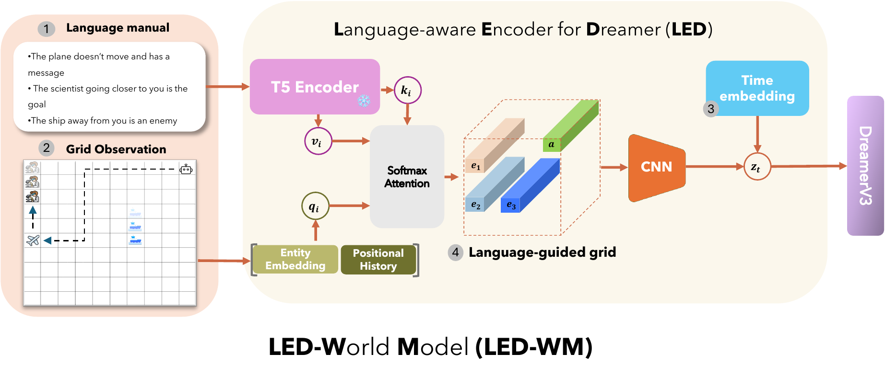
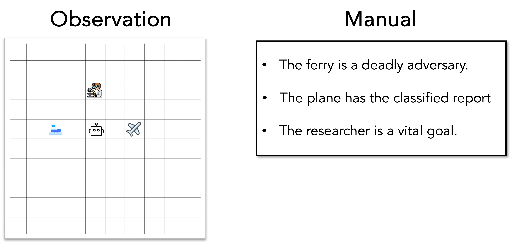
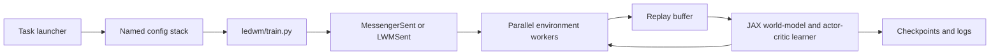

# Language-Conditioned World Models for Policy Generalization

[](led_wm.pdf)



This repository contains the code for the paper **Language-conditioned world
model improves policy generalization by reading environmental descriptions** by
Anh Nguyen and Stefan Lee, presented at the NeurIPS 2025 LAW workshop (Bridging
Language, Agent, and World Models for Reasoning and Planning).

The project trains a model-based reinforcement-learning agent that conditions
its world model on environmental descriptions to improve policy generalization.

The maintained training path in this checkout is the `ledwm` package. The
commands below cover Messenger Stage 1 (S1), Stage 2 (S2), Stage 3 (S3), the
[custom MESSENGER-WM tasks](https://arxiv.org/abs/2402.01695), and policy
finetuning.

## Repository layout

- `ledwm/` — agent, world model, replay, environments, training loop, and named
  YAML configurations.
- `messenger-emma/` — the Messenger environment used by S1, S2, S3, and LWM.
- `scripts/` — maintained task launchers and launcher tests.
- `docs/` — implementation and workflow notes.
- `dynalang/` — the earlier Dynalang implementation retained in this checkout.
- `vgdl/` — the VGDL environment support used by Messenger.

The task launchers all use the same high-level path:



## Installation

The provided [environment.yml](environment.yml) reproduces the CUDA 12
environment used for the experiments under the public name `ledwm_cuda12`. A
Linux x86-64 machine, compatible NVIDIA driver, and Conda or Mamba installation
are required.

From the repository root, create the environment and install both local
packages without changing the versions pinned in the environment file:

```bash
conda env create -f environment.yml
conda activate ledwm_cuda12
python -m pip install --no-deps -e .
python -m pip install --no-deps -e messenger-emma
python scripts/download_sentence_caches.py
```

The final command downloads the public
[LEDWM sentence caches](https://huggingface.co/datasets/realjoenguyen/ledwm-sentence-caches)
into `ledwm/embodied/envs/data`. The download is pinned to the cache revision
used by this checkout, requires approximately 870 MB of disk space, and verifies
all 28 files against the repository's SHA-256 manifest. No Hugging Face account
or access token is required. Re-running the command is safe; existing downloads
are reused. To check files without downloading, run:

```bash
python scripts/download_sentence_caches.py --verify-only
```

The environment includes JAX's pip-provided CUDA 12 plugin and NVIDIA runtime
libraries. The task launchers automatically activate `ledwm_cuda12` and create a
GPU-architecture-specific persistent JAX compilation cache.

Weights & Biases logging is enabled by default. Authenticate with `wandb login`,
or disable it for a run by adding `-- --use_wandb false` to the command.

## Quick start

Choose the physical GPU IDs and a global batch size. These examples use one GPU
and a batch size of 128.

### S1

```bash
./scripts/run_s1.sh --gpus 0 --batch-size 128
```

This loads the complete `s1_train` config and runs the Messenger Stage 1 task.
The default sequence length is `batch_length: 25`, and the default training
ratio is `run.train_ratio: 512`.

### S2

```bash
./scripts/run_s2.sh --gpus 0 --batch-size 128
```

This loads `s2_train`, including the S2, sentence, time, encoder, and
multi-step-decay settings required by the current model.

### S3

```bash
./scripts/run_s3.sh --gpus 0 --batch-size 128
```

This loads `s3_train` and runs Messenger Stage 3.

### LWM

Choose one of `easy`, `medium`, or `hard`:

```bash
./scripts/run_lwm.sh --task easy --gpus 0 --batch-size 128
./scripts/run_lwm.sh --task medium --gpus 0 --batch-size 128
./scripts/run_lwm.sh --task hard --gpus 0 --batch-size 128
```

The launcher loads `lwm_train`, sets the task to `lwm_<level>`, and reuses the
S2 launcher's device and batch handling.

## Test launchers

The task-specific test launchers use named flags and accept additional trainer
flags after `--`:

```bash
# Messenger S1 evaluation.
./scripts/run_s1_test.sh --gpus 0 -- \
  --run.from_checkpoint ./logdir/messenger/s1_sent/RUN/checkpoint_1.ckpt

# Messenger S2 checkpoint fine-tuning sweep.
./scripts/run_s2_test.sh --gpus 0 \
  --checkpoint ./logdir/messenger/s2_sent/RUN/checkpoint_1.ckpt

# Messenger S3 evaluation.
./scripts/run_s3_test.sh --gpus 0 -- \
  --run.from_checkpoint ./logdir/messenger/s3_sent/RUN/checkpoint_1.ckpt

# Messenger-LWM evaluation; LEVEL must be easy, medium, or hard.
./scripts/run_lwm_test.sh --task hard --gpus 0 -- \
  --run.from_checkpoint ./logdir/messenger/lwm_hard_sent/RUN/checkpoint_1.ckpt
```

S1 uses a fixed batch size of 100. S3 and LWM default to 100 and accept
`--batch-size N`; they also support `--dry-run`. The S2 launcher preserves the
existing 10-by-10 critic-learning-rate and fine-tuning-step sweep and requires
`bc`. Run any test launcher with `--help` for its complete interface.

## Batch size and multiple GPUs

`--batch-size` is the global learner batch. It must be divisible by the number
of selected GPUs:

```bash
./scripts/run_s2.sh --gpus 0,1 --batch-size 256
```

The GPU IDs in `--gpus` are physical CUDA device IDs. After masking them with
`CUDA_VISIBLE_DEVICES`, the launcher passes local JAX device IDs (`0,1,...`) to
the trainer automatically.

The launchers can probe for a fitting batch size on idle GPUs:

```bash
./scripts/run_s3.sh --gpus 0 --batch-size auto
```

Auto-batch probing compiles real task/model shapes, applies a 90% safety factor,
and caches the result. By default it probes in units of 128 per GPU. The selected
GPUs must each be using no more than 1024 MiB when probing begins. Use
`--auto-batch-min`, `--auto-batch-max`, `--auto-batch-quantum`, and
`--auto-batch-safety` to change the search.

## Common launcher options

All S1, S2, and S3 launchers support the same interface. LWM forwards these
options to the S2 launcher.

```text
--gpus IDS             Physical CUDA IDs, such as 0 or 0,1
--batch-size N|auto    Global learner batch size
--server LABEL         Optional run metadata
--configs NAMES        Replace the launcher's default named-config stack
--preset NAME          Append one named config to the selected stack
--resume               Resume the newest compatible run
--log-level LEVEL      TRACE, DEBUG, INFO, SUCCESS, WARNING, ERROR, or CRITICAL
--dry-run              Print the resolved environment and command
--                     Forward all remaining flags to ledwm/train.py
  --batch_length N     Sequence length per replay sample
  --run.train_ratio N  Training updates per environment step
```

Examples:

```bash
# Inspect a command without starting training. Use a numeric batch size unless
# an auto-batch result is already cached.
./scripts/run_s2.sh --gpus 0 --batch-size 128 --dry-run

# Override trainer settings after the `--` separator.
./scripts/run_s2.sh --gpus 0 --batch-size 128 -- \
  --batch_length 25 \
  --run.train_ratio 512 \
  --run.steps 2000000 \
  --logdir ./logdir/experiments/s2 \
  --use_wandb false

# Add a config without replacing the task's complete default stack.
./scripts/run_s1.sh --gpus 0 --batch-size 128 --preset debug
```

`--configs` replaces the default stack; it does not extend it. When using it,
include every preset required by the task. Prefer `--preset` for a small
addition to `s1_train`, `s2_train`, `s3_train`, or `lwm_train`.

Run any launcher with `--help` for its complete option list.

## Outputs, checkpoints, and resume

Unless `--logdir` is supplied, runs are placed below `./logdir` in task-specific
directories. Each run gets a seed/timestamp subdirectory containing at least:

- `config.yaml` — the fully resolved configuration.
- `stdout.log` and `stderr.log` — mirrored process output.
- `checkpoint_1.ckpt` — the parallel trainer checkpoint.
- `episodes/` — replay chunks used for training and full resume.

Resume the newest run that has both a checkpoint and replay data:

```bash
./scripts/run_s1.sh --gpus 0 --batch-size 128 --resume
```

If the original run used a custom log root, pass the same root again:

```bash
./scripts/run_s1.sh --gpus 0 --batch-size 128 --resume -- \
  --logdir ./logdir/experiments/s1
```

Use `--run.from_checkpoint` when initializing a new run from one specific
checkpoint instead of resuming the complete run state:

```bash
./scripts/run_s2.sh --gpus 0 --batch-size 128 -- \
  --run.from_checkpoint ./logdir/messenger/s2_sent/RUN/checkpoint_1.ckpt
```

## Policy finetuning

`run_finetune.sh` performs the repository's S2 policy-finetuning sweep. It
freezes the world model, loads the supplied checkpoint, and launches 100 runs:
10 critic learning rates crossed with 10 finetuning step counts. Runs execute
sequentially and the script requires `bc`.

```bash
./run_finetune.sh GPU_IDS ./logdir/messenger/s2_sent/RUN/checkpoint_1.ckpt
```

For example:

```bash
./run_finetune.sh 0 "$PWD/logdir/messenger/s2_sent/RUN/checkpoint_1.ckpt"
```

Edit `critic_lr_values` or `step_finetune_values` in `run_finetune.sh` before
launching if a full 100-run grid is not intended.

## Validation helpers

Launcher changes can be checked without starting a full training run:

```bash
bash -n scripts/run_s1.sh scripts/run_s2.sh scripts/run_s3.sh scripts/run_lwm.sh
bash -n scripts/run_s1_test.sh scripts/run_s2_test.sh \
  scripts/run_s3_test.sh scripts/run_lwm_test.sh
bash scripts/test_run_s1.sh
bash scripts/test_run_s2_s3.sh
```

For a real initialization/JIT check, forward compile-only mode:

```bash
WANDB_MODE=disabled ./scripts/run_s2.sh --gpus 0 --batch-size 128 -- \
  --run.compile_only true
```

## Citation

```bibtex
@inproceedings{led_wm,
  title = {Language-conditioned world model improves policy generalization by reading environmental descriptions},
  author = {Nguyen, Anh and Lee, Stefan},
  year = {2025},
  month = dec,
  booktitle = {Bridging language, agent, and world models for reasoning and planning (LAW) at NeurIPS 2025},
  location = {San Diego, CA},
  dimensions = {true},
}
```

## Acknowledgments

This codebase builds on:

- [Dynalang](https://github.com/jlin816/dynalang)
- [DreamerV3](https://github.com/danijar/dreamerv3)
- [Language World Models (LWM)](https://github.com/princeton-nlp/lwm/), which
  provides the Messenger-WM task foundation used here
