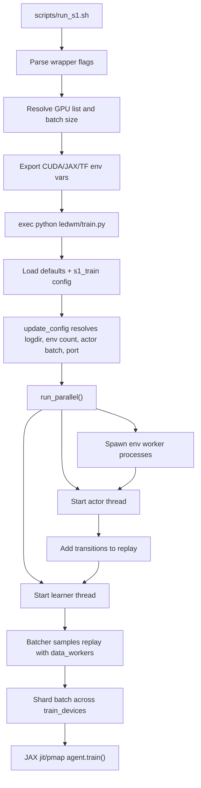
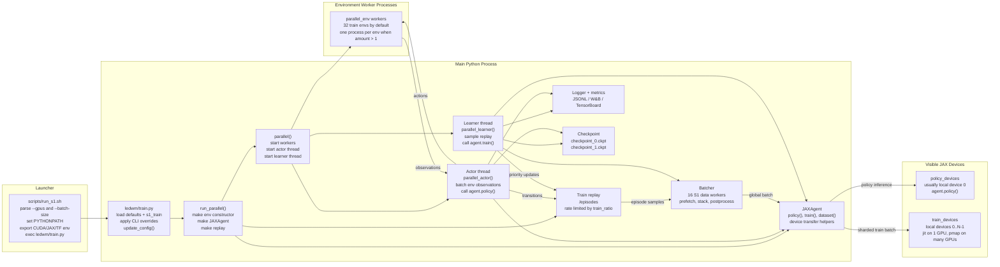

# `scripts/run_s1.sh` Parallel Workflow

This document describes what happens when you run `scripts/run_s1.sh`, with emphasis on the parallel workflow used by the default S1 training path.

## Quick Example

```bash
scripts/run_s1.sh --gpus 0,1 --batch-size 80
```

The wrapper resolves that to a command shaped like:

```bash
TF_CPP_MIN_LOG_LEVEL=2 \
TF_ENABLE_ONEDNN_OPTS=0 \
CUDA_VISIBLE_DEVICES=0,1 \
python ledwm/train.py \
  --configs s1_train \
  --jax.train_devices 0,1 \
  --jax.policy_devices 0 \
  --batch_size 80
```

Because `CUDA_VISIBLE_DEVICES=0,1` remaps the visible GPUs, `--jax.train_devices 0,1` means "use both visible local JAX devices", not necessarily physical GPU IDs 0 and 1 after JAX starts. With `--batch-size 80` and two train devices, JAX shards the training batch as 40 samples per GPU.

## High-Level Flow



## Component Diagram

Read this left to right: the launcher resolves the process environment, the main Python process owns the actor/learner/replay components, env workers run as separate processes, and JAX devices execute policy and training work.



## 1. Shell Wrapper Resolution

`scripts/run_s1.sh` is a launcher. It does not train directly.

It first sets:

```bash
PYTHONPATH="$repo_root:$repo_root/messenger-emma:$PYTHONPATH"
```

Then it parses wrapper-owned flags:

- `--gpus IDS`: physical CUDA IDs to expose, for example `0` or `0,1,2,3`.
- `--batch-size N`: global training batch size.
- `--server LABEL`: forwarded as `--run.server LABEL`.
- `--configs NAMES`: config stack override.
- `--preset NAME`: append one named config to the config stack.
- `--dry-run`: print the resolved command without starting training.
- Everything after `--`, or any unknown `--flag`, is forwarded to `ledwm/train.py`.

If `--configs` is omitted, the wrapper uses:

```bash
--configs s1_train
```

The wrapper counts GPUs from `--gpus`, checks that `batch_size % num_gpus == 0`, and creates a local JAX device list:

```bash
--jax.train_devices 0,1,...,num_gpus-1
--jax.policy_devices 0
```

It also exports:

- `CUDA_VISIBLE_DEVICES=$gpu_ids`
- `TF_CPP_MIN_LOG_LEVEL`, default `2`
- `TF_ENABLE_ONEDNN_OPTS`, default `0`
- optional JAX memory allocator variables from forwarded `--jax.*` flags

Finally, for a real run, it uses `exec "${cmd[@]}"`, replacing the shell process with `python ledwm/train.py`.

## 2. Train Startup

`ledwm/train.py` configures JAX-related environment before importing JAX, enables the persistent compilation cache when available, then loads config files through the agent config registry.

For the default wrapper path:

```bash
--configs s1_train
```

`ledwm/s1.yaml` defines `s1_train` as an include stack ending in `s1`, and sets the important S1 training values:

- `run.script: parallel`
- `task: messenger_s1`
- `batch_length: 150`
- `data_workers: 16`
- `replay.size: 2e4`
- `run.train_ratio: 64`
- `env.messenger.length: 4`
- `rssm.deter: 256`
- `load_exclude_key: sent_embed`

After CLI overrides are applied, `update_config()` does runtime resolution:

- chooses a random seed
- creates the run log directory
- if `envs.amount == 0`, resolves it from `train_ratio`
- if `run.actor_batch == 0`, sets it to `envs.amount`
- assigns a random actor server port
- verifies the configured train device count matches the number of visible JAX devices

For default `s1_train`, `run.train_ratio` is 64 and `envs.amount` starts at 0, so the code resolves:

```text
envs.amount = int(512 / 64 * 4) = 32
actor_batch = 32
```

Then `run.script: parallel` dispatches into:

```python
run_parallel(logger, config, args, logdir)
```

## 3. `run_parallel()` Setup

`run_parallel()` creates the pieces used by the online training loop:

1. Build a train environment constructor with `wrapped_env(config, batch=False)`.
2. Create one temporary environment to read observation/action spaces and env cache.
3. Build the JAX-wrapped agent.
4. Close the temporary environment.
5. Create the training replay at:

```text
<logdir>/episodes
```

6. Call `ledwm.embodied.run.parallel.parallel(...)`.

The replay is rate-limited for online training. For S1, the rate limiter uses `run.train_ratio / batch_length`, so training throughput is coupled to how much environment data has been inserted.

## 4. Process and Thread Layout

The main parallel runner creates:

- env workers for `range(config.envs.amount)`
- one actor thread
- one learner thread
- optional eval/test workers only for scripts like `parallel_train_eval` or `parallel_train_eval_test`

For default S1, there are no eval/test workers because the script is just `parallel`.

With the resolved default `envs.amount = 32`, the runner starts 32 train env workers. If there is more than one env ID, each env worker is a separate `distr.Process` running:

```python
parallel_env(env_id, make_train_env, args, worker_addr2type)
```

The actor and learner are `distr.Thread`s in the main process:

```python
parallel_actor(...)
parallel_learner(...)
```

Then `distr.run(workers)` supervises them.

## 5. Environment Worker to Actor Loop

Each `parallel_env` worker:

1. Creates its own environment.
2. Connects to the actor server at `args.actor_host:args.actor_port`.
3. Resets when an episode is done.
4. Calls `env.step(act)`.
5. Sends the observation to the actor.
6. Waits for the next action.
7. Repeats forever.

The actor thread batches observations. Once `actor_batch` env observations are ready, `parallel_actor.callback()`:

1. Looks up the recurrent state for each env address.
2. Calls:

```python
agent.policy(obs, states, step=obs_steps, mode="train")
```

3. Adds `reset = obs["is_last"]` to the returned actions.
4. Stores updated per-env policy states.
5. Increments `env_step` by `actor_batch`.
6. Adds train transitions into replay with `train_replay.add(...)`.

Policy inference is pinned by the wrapper to:

```bash
--jax.policy_devices 0
```

So by default, actor policy inference runs on visible local JAX device 0.

## 6. Replay to Learner Loop

`parallel_learner()` creates a dataset from replay:

```python
train_dataset = agent.dataset(train_replay.dataset)
```

Inside `JAXAgent.dataset()`:

- the replay generator is duplicated `batch_size` times
- `Batcher` uses `config.data_workers` worker threads
- for S1, `data_workers` is 16
- source prefetch defaults to 4
- batch prefetch defaults to 4
- postprocessing shards the batch to `train_devices` and adds a per-device RNG

The learner loop then repeats:

1. Pull next replay batch.
2. Increment `opt_step`.
3. Compute balanced reward weights if configured.
4. Call:

```python
agent.train(batch, state=None, step=..., imbalanced_reward_weights=...)
```

5. Update replay priorities when prioritized replay metrics are available.
6. Log train, replay, and parallel throughput metrics.
7. Save `checkpoint_1.ckpt` on the configured save interval.

## 7. JAX Multi-GPU Data Parallelism

The JAX parallelism is handled inside `ledwm/jaxagent.py`.

At agent initialization:

```python
available = jax.devices(config.jax.platform)
policy_devices = [available[i] for i in config.jax.policy_devices]
train_devices = [available[i] for i in config.jax.train_devices]
```

The wrapper has already restricted visible devices with `CUDA_VISIBLE_DEVICES`, so these indices are local JAX indices.

Training functions are transformed like this:

- one train device: `nj.jit(..., device=train_devices[0])`
- multiple train devices: `nj.pmap(..., "i", devices=train_devices)`

For multi-GPU training, `_convert_inps()` enforces that every batched array has a leading dimension divisible by the number of train devices. It reshapes each batch leaf from:

```text
[global_batch, ...]
```

to:

```text
[num_devices, per_device_batch, ...]
```

Then it places each shard on the corresponding device with `_device_put_sharded(...)`.

Example:

```text
--gpus 0,1 --batch-size 80
num_devices = 2
per_device_batch = 40
```

Model variables are replicated across train devices. Outputs are copied back and flattened from device-major shape to normal batch-major shape. Metrics are taken from the first replica after pmap.

When train and policy devices are not the exact same single device setup, the agent keeps a policy copy of variables and syncs train variables to policy variables every `config.jax.sync_every` updates.

## 8. Practical Parallel Knobs

Common launch controls:

```bash
# 1 GPU
scripts/run_s1.sh --gpus 0 --batch-size 40

# 2 GPUs, global batch 80, 40 per GPU
scripts/run_s1.sh --gpus 0,1 --batch-size 80

# 4 GPUs, global batch 160, 40 per GPU
scripts/run_s1.sh --gpus 0,1,2,3 --batch-size 160

# Print the resolved command only
scripts/run_s1.sh --gpus 0,1 --batch-size 80 --dry-run
```

Forwarded train flags go after `--`:

```bash
scripts/run_s1.sh --gpus 0,1 --batch-size 80 -- \
  --run.actor_batch 16 \
  --envs.amount 32 \
  --jax.mem_fraction 0.7
```

Important constraints:

- `--batch-size` must be divisible by the number of GPUs in `--gpus`.
- `len(config.jax.train_devices)` must match the number of JAX-visible devices.
- `--jax.policy_devices 0` means policy inference shares visible GPU 0 with training unless you override it.
- More env workers increase actor/replay production pressure; more train devices increase learner throughput only if the batch size and model work are large enough to keep them busy.
